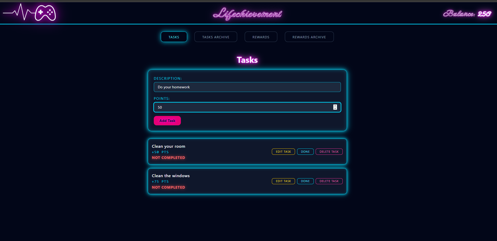
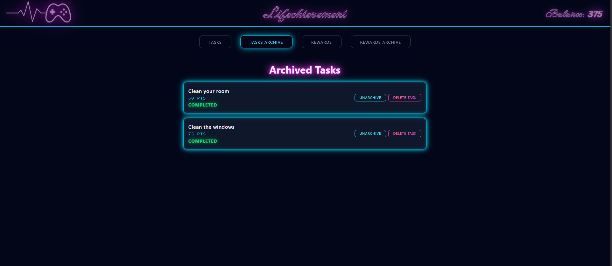
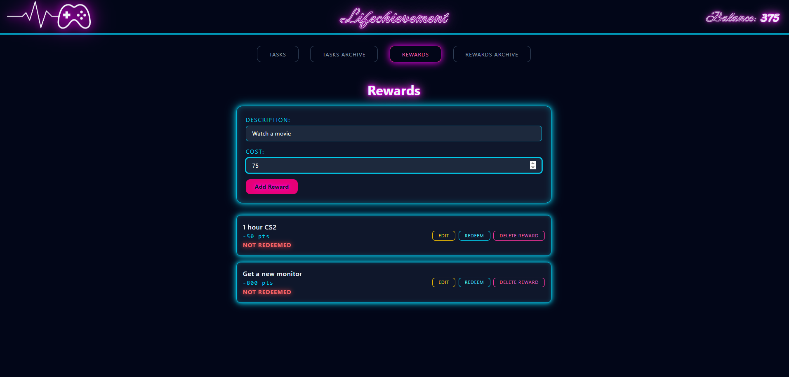
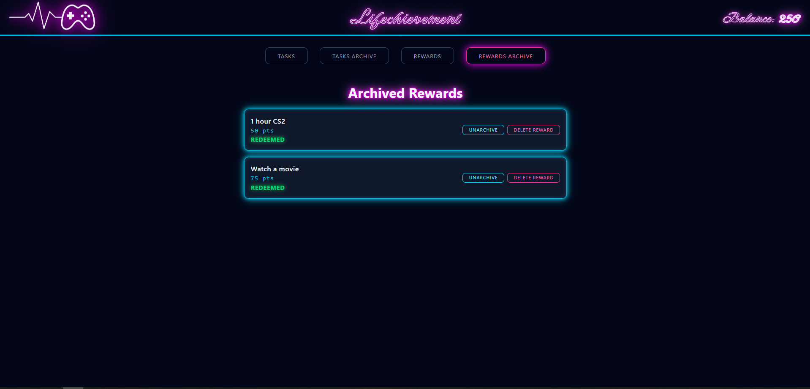
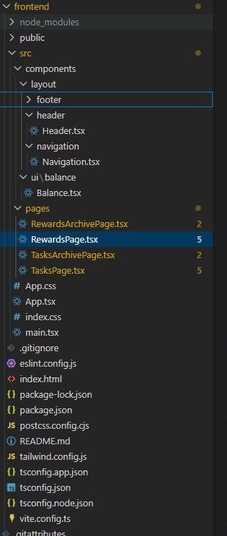
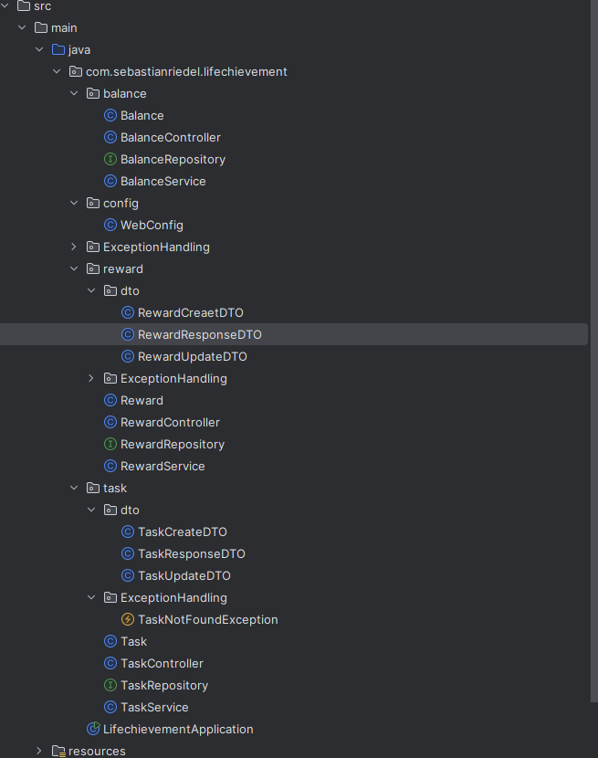

# Sebastian Riedel Portfolio
# Lifechievement

This project is a fullstack application built with React, TypeScript, Java Spring Boot and H2/JPA with hibernate.  It demonstrates managing frontend state, interacting with a backend API, and persisting data in a database.

Users can add Tasks and Rewards and define each with a description and points or costs. The user can then modify those tasks and rewards, update them, change their status, delete them. All data is stored persistently in H2/JPA and synchronized with the React frontend via REST API calls.

---

## Project Goals
- Build a full-stack application using a Spring Boot backend and React frontend
- Practice implementing REST APIs with CRUD operations
- Learn how to manage application state in React
- Connect frontend actions with backend logic through API requests
- Implement simple business logic (task completion affecting a point balance)

---

## Features
- Create, view, edit, and delete Tasks
- Toggle task completion status
- Create and manage Rewards
- Automatic point balance calculation based on completed tasks
- Dynamic UI updates without full page reloads
- Simple multi-page navigation between Tasks and Rewards

---

## Tech Stack
Frontend
- React
- TypeScript
- Axios
- Tailwind

Backend
- Spring Boot
- Spring Web
- Spring Data JPA

Database
- PostgreSQL / JPA persistence

DevOps
-Docker

---

## Screenshots

---

## Repository
GitHub Repository: [Link to repo](https://github.com/SebastianR0589/lifechievement_project)
